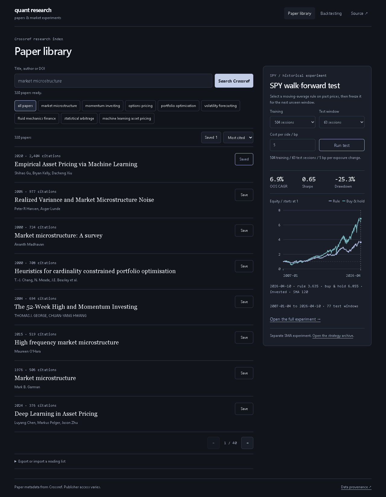
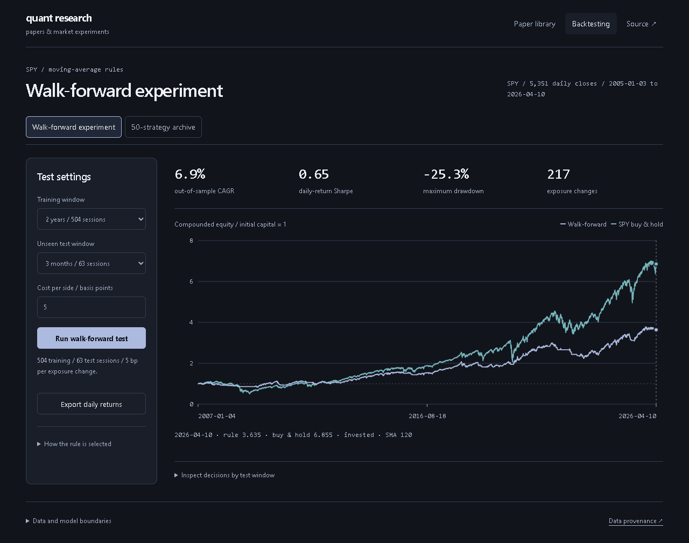

# Quant research & backtesting

Find papers, keep their sources and test a market rule on unseen prices after costs.

[Paper library](https://lolstar123.github.io/quant-research-scraper/) | [Walk-forward experiment](https://lolstar123.github.io/quant-research-scraper/backtesting/)



## Try it

The library starts with 320 Crossref paper records. Search titles, authors or DOIs, filter by topic, save a reading list and export JSON or BibTeX. **Search Crossref** makes a real network request for metadata; local filtering uses the bundled library. Saved papers persist in browser storage. JSON import merges duplicates by DOI or title.

The SPY panel runs a separate moving-average experiment on 5,351 historical closes. Choose the training window, unseen test window and trading cost, then run it. Pointer or arrow keys inspect both equity curves on one date. Open the full experiment for the decisions by window and daily-return CSV.



The full workbench also contains 50 archived Python strategy outputs with their paper references. Saving a paper does not implement its strategy, and the archive does not reproduce the browser's SMA test.

[Library on a phone](examples/portfolio/preview-mobile.png) | [Experiment on a phone](examples/portfolio/backtesting/preview-mobile.png)

## Run locally

The browser demo has no package dependencies or build step. Serve it over HTTP with Python 3:

```sh
git clone https://github.com/LolStar123/quant-research-scraper.git
cd quant-research-scraper
python -m http.server 8000 --directory examples/portfolio
```

Open **http://localhost:8000/**. Use a second terminal for checks. Node 18 or later runs the model tests:

```sh
node --test examples/portfolio/model.test.mjs examples/portfolio/backtesting/model.test.mjs
```

Browser checks use Python Playwright. On Windows they launch installed Google Chrome; on other platforms install Playwright Chromium:

```sh
python -m pip install playwright
# Needed when not using the installed Windows Chrome:
python -m playwright install chromium
python tools/browser_audit.py
python tools/backtesting_audit.py
```

Verified on Python 3.11.9, Node 24.12.0 and Playwright 1.57.0. The checks run temporary local servers and headless browsers, test controls and errors, and save screenshots under ignored `output/redesign/`. Crossref success and failure in the browser audit use explicit fixtures.

## Collect metadata

The standard-library HTML collector reads citation tags and deduplicates records. The supplied page is an authored parser fixture:

```sh
python collector/collect.py collector/paper.html --output output/reading-list.json
```

To collect current public Crossref metadata without overwriting the bundled library:

```sh
python collector/refresh_catalogue.py --query "market microstructure" --rows 10 --output output/crossref.json
```

The second command needs network access and follows the collector's rate-limit retries.

## Code map

| Path | Responsibility |
| --- | --- |
| `examples/portfolio/index.html`, `style.css`, `app.mjs` | Paper library, saved state, imports and Crossref requests |
| `examples/portfolio/model.mjs` | Paper normalization, DOI/title deduplication, search and BibTeX |
| `examples/portfolio/backtesting/model.mjs` | Lagged SMA signals, rolling selection, costs and return statistics |
| `examples/portfolio/backtesting/chart.mjs` | Responsive SVG axes and keyboard/pointer inspection |
| `examples/portfolio/backtesting/data/` | Preserved SPY closes and 50-strategy archive |
| `collector/` | HTML citation parser and Crossref catalogue collector |
| `research/backtesting/` | Original Python research, requirements, outputs and [run instructions](research/backtesting/README.md) |
| `tools/` | Repeatable headless desktop/mobile flow checks |

## Data and boundaries

[Paper provenance](PROVENANCE.md) records the Crossref collection. [Market provenance](research/backtesting/PROVENANCE.md) records the historical cache and original research. Corporate-action adjustment provenance is unresolved; the plotted returns are a reproducible research exercise, not audited investment performance.

The browser chooses among 20, 60, 120 and 200-day SMA rules using training Sharpe, freezes the selected period for the next test window and subtracts costs when exposure changes. It has no leverage, cash interest or taxes. Archived strategy rankings introduce selection bias. Crossref supplies metadata, not publisher full text.
