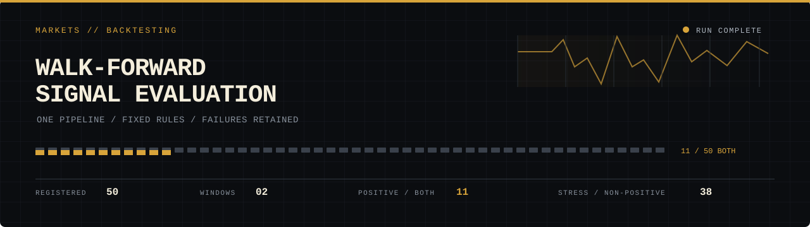
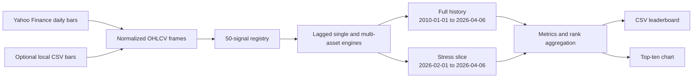

<!-- working-example:start -->
## Run a real historical experiment

**[Open the research workbench](https://lolstar123.github.io/markets-backtesting/)**

The browser loads 5,351 historical SPY closes from the existing research cache. It selects a
moving-average rule within each training window, freezes that choice for the next test window,
lags positions and subtracts trading costs. Change the windows and fees, rerun, inspect each
choice and export the out-of-sample returns.

A separate archive presents all 50 original strategy results from
`quantihack_alt_data_50_results.csv`, including full-period and stress-window statistics and
paper references. These recorded research runs are not silently relabelled as the browser experiment.


```sh
python -m http.server 8000 --directory examples/portfolio
node --test examples/portfolio/model.test.mjs
```

The price cache's corporate-action adjustment provenance has not been independently
reverified. Treat the browser results as a reproducible research exercise, not audited investment
performance. Recurring public browser checks run every four hours. Model checks explicitly
perturb future data and verify that earlier choices and returns do not change.
<!-- working-example:end -->

<picture>
  <source media="(prefers-color-scheme: dark)" srcset="assets/banner-dark.svg">
  <source media="(prefers-color-scheme: light)" srcset="assets/banner-light.svg">
  
</picture>

# Markets Backtesting

A walk-forward evaluation harness that runs 50 academically sourced market signals through one
data, execution-cost, and metrics pipeline. It downloads daily price history, replays fixed rules
across a full-history window and a focused stress window, then ranks every completed run without
hiding the failures.

The hard part is comparability. Calendar effects, cross-asset regimes, price-range estimators,
sentiment proxies, and volatility rules all produce different shapes of data. This project gives
each one the same lagged execution model, cost accounting, evaluation windows, and result schema.

## Evaluation status

The committed run contains 50 completed signals and 22 fields per result. The split is useful:
the stress window rejects far more ideas than the full-history measure does.

| Readout | Result |
|:--|--:|
| Registered and completed | 50 / 50 |
| Positive full-history Sharpe | 39 |
| Non-positive full-history Sharpe | 11 |
| Positive stress-window return | 12 |
| Non-positive stress-window return | 38 |
| Positive on both measures | 11 |

These counts are calculated from the committed
[result set](quantihack_alt_data_50_results.csv). A positive measure is strictly greater than
zero. No non-positive row is removed from the leaderboard.

### Leading combined ranks

The ranking is the mean of two ordinal ranks: full-history Sharpe and stress-window return.

| Signal | Literature reference | Full-history Sharpe | Stress return | Combined rank |
|:--|:--|--:|--:|--:|
| Conditional Risk Parity | Asness et al. (2012), SSRN 2050064 | 0.758 | 1.957% | 4.0 |
| Parkinson Regime Switch | Parkinson (1980) | 0.642 | 4.374% | 6.5 |
| Holiday Effect | Ariel (1990); Lakonishok and Smidt (1988) | 0.595 | 4.803% | 7.0 |
| Round Number Avoidance | Bhattacharya et al. (2012), SSRN 1364960 | 0.694 | 1.096% | 7.0 |
| Volume-Weighted RSI(2) | Lerman et al. (2008), SSRN 1121475 | 0.605 | 2.459% | 7.5 |

Displayed values are truncated from the stored precision in the
[CSV output](quantihack_alt_data_50_results.csv). The complete chart is committed alongside it.


## How the run works



The engines apply positions one bar after the signal. Single-asset runs charge 1 basis point when
the position changes. Multi-asset runs charge 5 basis points on total weight turnover. The output
includes CAGR, Sharpe, Sortino, maximum drawdown, Calmar, volatility, win rate, profit factor,
skew, tail ratio, and beta.

The stress period is a date slice from each generated equity curve. It is a consistent regime
check, but it is not a separately trained holdout. The Sharpe calculation uses daily returns and
does not subtract a risk-free rate.

## Run it

The verified run used Python 3.11.9. The command needs network access for Yahoo Finance unless
the optional local daily-bar CSVs are present.

```bash
git clone https://github.com/LolStar123/markets-backtesting.git
cd markets-backtesting
python -m pip install -r requirements.txt
python quantihack_alt_data_50.py
```

The command writes:

- `quantihack_alt_data_50_results.csv`: all completed runs, metrics, and ranks.
- `quantihack_alt_data_50.png`: full-history and stress-window curves for the top ten ranks.

Local data can be placed under `ibkr_data/` using the filenames declared in
[`IBKR_MAP`](quantihack_alt_data_50.py). If a local file is missing, the loader requests the same
symbol from Yahoo Finance.

## Repository map

| Path | Responsibility |
|:--|:--|
| [`quantihack_alt_data_50.py`](quantihack_alt_data_50.py) | Data loading, indicators, 50-signal registry, evaluation, ranking, and outputs |
| [`quantihack_alt_data_50_results.csv`](quantihack_alt_data_50_results.csv) | Reproducible result table used for every number in this README |
| [`quantihack_alt_data_50.png`](quantihack_alt_data_50.png) | Generated comparison chart |
| [`quantihack_algo_baseline.py`](quantihack_algo_baseline.py) | Separate 16-symbol baseline used as a reference implementation |
| [`requirements.txt`](requirements.txt) | Runtime dependencies |

## Scope

This is research and evaluation code. It has no broker integration, order routing, or live
execution. Several literature-inspired signals use price-derived proxies because their original
datasets are unavailable here. Read the implementation comments before interpreting a result.
Historical output is evidence about this fixed run, not a forecast.

Contributions should keep signal functions deterministic, preserve one-bar execution lag, and
record any metric or cost-model change that would break comparability. See
[CONTRIBUTING.md](CONTRIBUTING.md) for the short workflow. The project is available under the
[MIT License](LICENSE).
